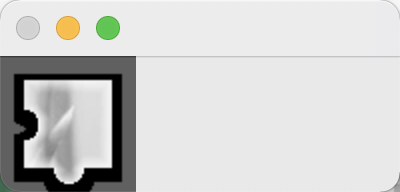
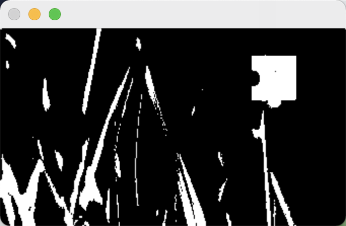
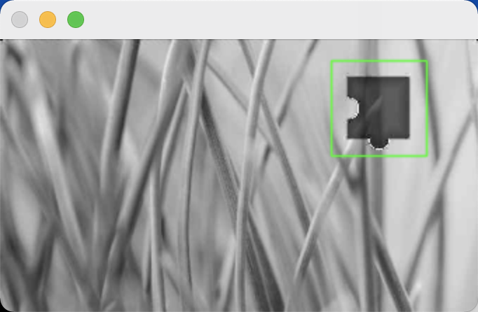
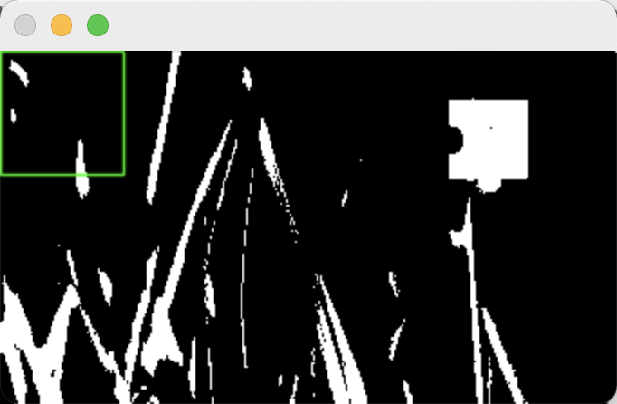

### 一、背景

滑块验证码是一项人机识别技术，操作简单，真人体验好，机器识别效果也不差，可以有效防止脚本做任务，增加机器脚本薅羊毛的难度。但其破解也相对简单，这里演示一个Demo，以了解。通过 OpenCV 匹配找出滑块位置，计算出滑动距离，然后模拟 js 鼠标事件，在 Chrome 控制台执行脚本，完成破解动作。

### 二、思路

先看一下效果：

滑块验证码主要有三个元素组成：带缺口的背景大图（bg）、缺口小块（block)、滑块（slide）。

目标是把缺口移动到对应的位置，也就是说要解决两个问题：1.滑块移动距离；2.模拟移动。

#### 计算滑块移动距离

OpenCV 有模板匹配方法，可以通过多种算法找到小图（即模板）在大图中的位置。

1. OpenCV 读取 带缺口的背景大图（bg）、缺口小块（block) 图片，原始图片颜色有 256*256*256 种。

 

2. 把两个图片都转成灰度图片，这样图片只有 256 种颜色了，大大降低计算量，加快匹配速度。

 

3. 二值化，即把图片变成只有纯黑和纯白两种颜色，进一步减小计算量，加快匹配速度。

 

当然，二值化之后，图片可能出现大面积黑色或大面积白色，造成匹配结果错误。所以本文没有使用二值化，而是使用灰度图像匹配。

4. 开始匹配。下面左图是灰度匹配的结果，非常准，右图是二值化后匹配的结果，匹配失败。

 

匹配过程有一些细节，对匹配结果会造成很大影响，例如，

1. 图片处理非常重要，例如缺口小块是不规则的，边缘透明，那么这部分不能参与匹配，要使用掩码，而且掩码要尽可能和缺口互补。

2. 匹配算法有很多种，选择合适的。

3. 匹配不可能100%准，需要在性能和准确率之间平衡，例如上面提到的是否一定要二值化。

#### 模拟移动

WebAPI 有个 Document.createEvent() 函数，可以用来模拟各种事件。

这里需要模拟的是鼠标移动，主要控制的是反应时间、按下位置、移动速度，大多数人操作验证码在 1-2s ，先快后慢。

这里只是为了演示，论证破解的可行性，所以是匀速滑动的，按下位置是随机的。

### 三、实战

这里演示的是 Chrome 下破解 腾讯防水墙 可疑用户 滑块验证码 https://007.qq.com/online.html?ADTAG=index.head ，所以使用的工具和技术非常简单，Chrome 控制台+Golang+OpenCV4.5.1。

Chrome 控制台 用于执行 js，获取图片内容，调用 Golang 服务，得到滑动距离，模拟滑动。

Golang 接收图片，调用 OpenCV，匹配缺口位置，返回给客户端。

OpenCV 强大的计算机视觉算法开源库。

#### Go 服务

js 无法直接调用 OpenCV，但可以调用 Web服务，而且 Web 服务通用性好，可以对接不同的前端。

1. 开启一个Go服务，接收参数，并返回移动距离，注意要支持跨域。

    接收的参数包括 带缺口的背景大图（bg）、缺口小块（block) 图片 Base64 格式的内容和他们在网页上显示的大小（非真实大小）。显示大小用于缩放图片，使缺口小图能和大图上的缺口大小完全一致，提高匹配成功率。

2. 图片预处理。

    1）先通过 gocv 库，读取图片，注意 缺口小图边缘透明的，所以有 4个通道（BGRA），完整读取。
    
    2）把图片大小调整到网页显示的大小。
    
    3）变成灰度图像。
    
    4）二值化（可选）。

3. 匹配。

    1）由于缺口小图不规则，所以需要使用掩码，掩码图像刚好就是缺口小图的 Alpha通道 即透明度，所以直接使用这个通道即可。
    
    2）选定一种算法，不同的算法，结果可能会不一样，开始匹配，并对中间结果归一化处理，然后根据选择的算法，选择最佳匹配结果，即移动距离。
    
    [http://zhaoxuhui.top/blog/2017/06/12/%E5%9F%BA%E4%BA%8EPython%E7%9A%84OpenCV%E5%9B%BE%E5%83%8F%E5%A4%84%E7%90%8614.html](http://zhaoxuhui.top/blog/2017/06/12/基于Python的OpenCV图像处理14.html)
    
    这篇文章对此讲解得非常到位，所以这里不多缀述。

#### js 脚本

1. 获取图片内容和大小。

      带缺口的背景大图（bg）、缺口小块（block) 都有固定的 id，取得dom的 src 属性，然后通过 FileReader 读出图片内容。
      图片大小即 clientWidth/clientHeight。
  
2. 调用 Go 服务，得到 移动距离。 
3. 模拟移动。

    1）确定滑动位置和滑块元素。
    
    2）创建鼠标事件。
    
    3）计算滑动速度，模拟移动鼠标。

### 四、体验

1. 开启 Go 服务，注意 gocv 只是包装了 OpenCV，开启服务前必须安装 OpenCV，参考 https://github.com/hybridgroup/gocv#macos 。

2. 用 Chrome 打开 腾讯防水墙主页 https://007.qq.com ，依次点击 "可疑用户"-"体验验证码"，弹出滑块验证码。

3. 调出开发者工具，选择 "控制台"，由于滑块验证码嵌入在 iframe 中，所以要把控制台的上下文从 "top" 切换成 "tcaptcha_iframe(cap_union_new_show)"。（注意是 cap_union_new_show， 不是 drag_ele.html。）

4. 把 slide.js 所有代码粘贴到控制台，回车执行 js，即可看到滑块验证码开始移动。如果一次不成功，再点击"体验验证码"，上下文，多试几次，因为匹配不能保证100%准确。（注意每次执行执行 js 前都要切换上下文，否则会报错找不到对象。）

### 五、思考

1. 匹配前还可以根据验证码特点做很多优化，例如 缺口高度是固定的，而且位置都靠右，这样匹配位置可以确定在很小的范围内，大大提高匹配效率。

2. 验证码生成过程是很耗时的，一般系统都是预先生成有限个验证码图片，重复利用，所以，如果加上缓存，同样的验证码图片无需重复计算滑动距离，匹配算法变成一次简单的查缓存了。

3. 真人滑动验证码是有一定反应时间的，不如机器反应灵敏，所以真实情况破解程序要休眠一点时间。

4. 真人滑动验证码，到终点时不仅速度慢，结果还有可能不会完全吻合，相差几个像素，还有可能来回微小移动。

5. 真人滑动验证码，按下位置可能在滑块（slide）中间部位，但不会每次都是正中。

6. 移动端的验证码真人是用手指滑动的，所以按压力度也需要注意。

7. 真人滑动验证码滑动过程，即轨迹，不会完全是直线的。

所以破解验证码，不仅要计算滑动距离，还要模拟**反应时间、按下位置、移动速度**，还要模拟**按压力度、滑动轨迹（并非绝对直线）**。

除此只外，当前环境和脚本也需要伪装或隐藏，所处的位置（IP、GPS等）、使用的设备等信息在破解量大时需要不断更换。

当然破解是个对抗的过程，如果验证码没有对移动速度、滑动轨迹、设备、环境等做风控策略，那么破解就相对简单。

转换一个角色，验证码防护如果做了各个方面的策略（除上面提到的，还有其他策略），不需要面面俱到，也不需要做得非常复杂，仅仅在多个方面都做一些简单的风控，就可以拦截大部分机器脚本，大大增加破解难度。

### 参考

**GoCV：** [https://github.com/hybridgroup/gocv](https://github.com/hybridgroup/gocv#macos)

**OpenCV 模板匹配：**[ http://zhaoxuhui.top/blog/2017/06/12/%E5%9F%BA%E4%BA%8EPython%E7%9A%84OpenCV%E5%9B%BE%E5%83%8F%E5%A4%84%E7%90%8614.html](http://zhaoxuhui.top/blog/2017/06/12/基于Python的OpenCV图像处理14.html)

**破解腾讯拼图验证码：** https://www.freebuf.com/geek/265662.html

**破解顶象：** [https://www.freebuf.com/geek/265479.html ](https://www.freebuf.com/geek/265479.html)

